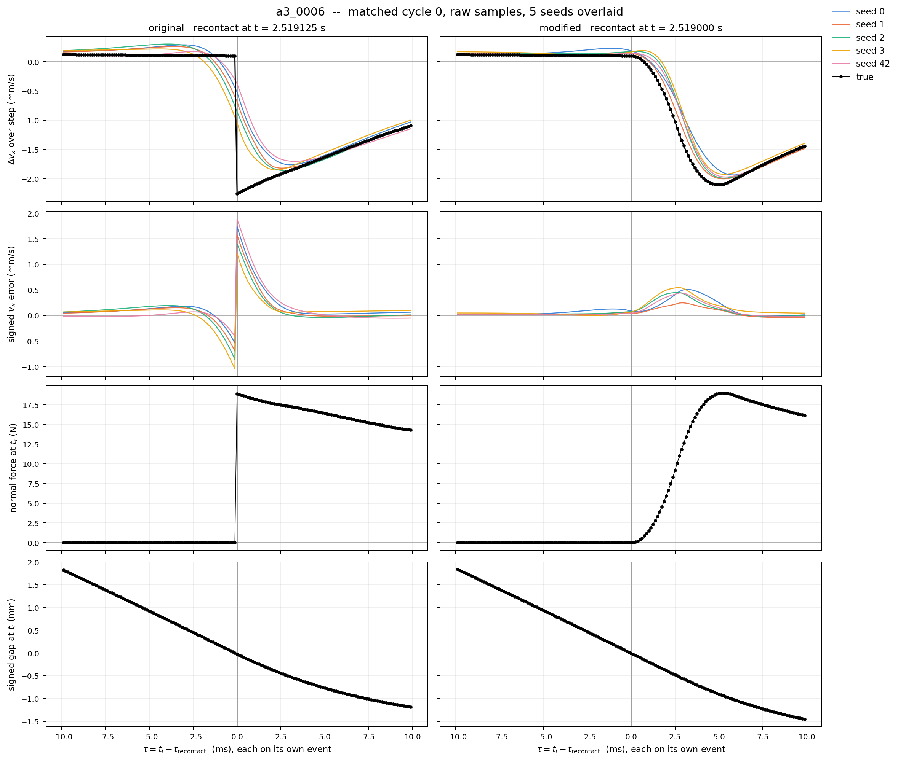
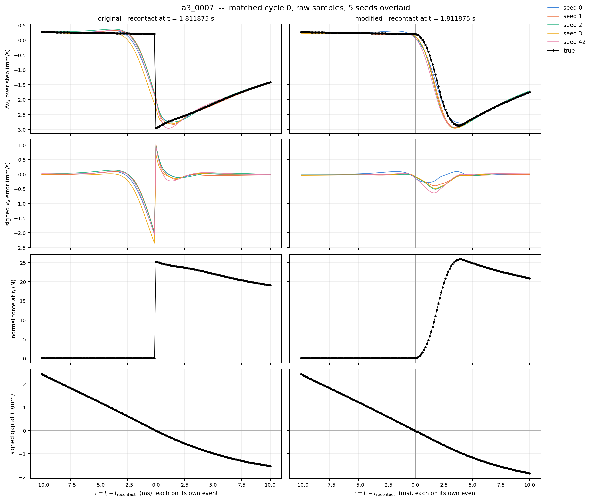
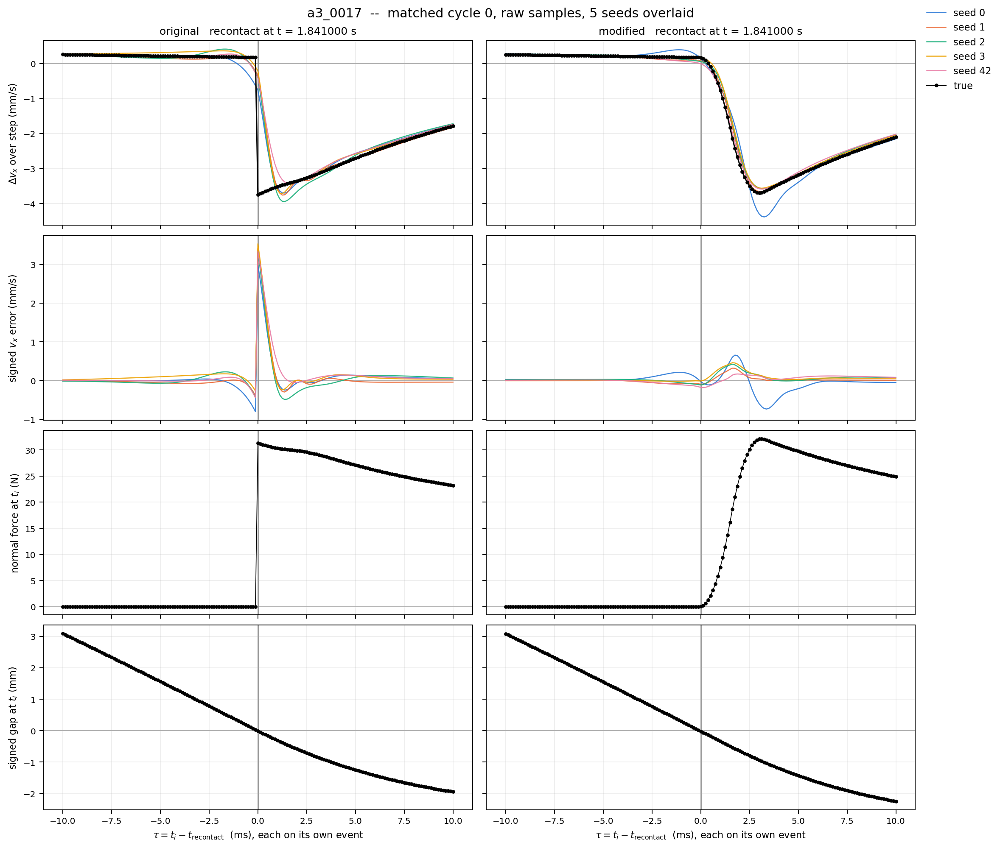

# Contact Mode Diagnostics
## Summary
A mode-agnostic neural dynamics model concentrates its per-step prediction error at recontact. In a paired experiment that changed only how the contact force switches on (near-instant vs 3-5 ms ramp), the recontact window prediction error decreased about 65% while the error in shallow sustained contact increased in all 5 seeds. The prediction error at free-flight (identical physics across conditions) weren't consistent on all seeds. All results are on validation episodes.

## Motivation
World models for contact-rich manipulations usually employ smooth function approximators; however, contact onsets are discontinuous at typical sampling rates. Therfore, this project isolates that mismatch at the simulator to investigate where a mode-agnostic predictor fails, and whether that error comes from contact or depends on how sharply the contact switches on.

## Simulation Environment
We deliberately used a minimal system to make the mechanisms and labels inspectable:
- A 1 kg sphere with two translational DOF
- $x$: normal to a fixed wall; $y$: tangential
- No rotation, gravity, table, or robot
- Friction coefficient $\mu = 0.5$
- Force motors acting along both coordinates
- MuJoCo 3.12.0, Newton solver, elliptic friction cone, solver tolerance $10^{-10}$
- Primary simulation and prediction interval: 0.125 ms
- Signed gap: `mj_geomDistance` between sphere and wall; negative values mean penetration

| Protocol | Purpose | Excitation |
|---|---|---|
| A2 | Quasi-stick→slide→quasi-stick under continuous normal contact | Constant normal preload; cyclic tangential force |
| A3 | Repeated controlled separation/recontact | Moving support connected through a spring–damper force |
| A2 quasi-stick control | Force variation without clear sliding | Tangential force kept below the intended sliding regime |
| A3 contact control | Normal dynamics without separation | Small support oscillations |
| A3 free control | Dynamics without wall contact | Support motion sufficiently far from the wall |


## Dataset summary for both experiments:
| Item | E1 | E1A |
|---|---|---|
| Accepted dataset | 23 episodes | 60 pairs / 120 primary episodes |
| Train / validation / test | 13 / 5 / 5 episodes | 42 / 9 / 9 episodes per condition |
| Rejection outcome | 0 rejected | 0 rejected pairs |
| Split unit | Whole episode | Whole pair |

## E1 Experimental Design
A2 used normal preloads over 8-12 N and varied the tangential force schedule. It aimed to produce repeated transitions while returning to stable quasi-stick.
A3 used a moving support to drive controlled separation and recontact. The support initially remains stationary for 0.3 s, then its oscillation amplitude increases smoothly over 0.5 s. After this startup ramp, its motion is

```math
t' = t - t_{\text{settle}}, \qquad t_{\text{settle}} = 0.3\ \mathrm{s}
```

```math
x_{\text{support}}(t) = x_0 + A\sin(2\pi f t' + \phi)
```

```math
v_{\text{support}}(t) = 2\pi f A\cos(2\pi f t' + \phi)
```

The applied forces were

```math
F_x = k\,(x_{\text{support}} - q_x) + c\,(v_{\text{support}} - v_x), \qquad F_y = 0
```

with $`k = 1000\ \mathrm{N/m}`$ and $`c = 30\ \mathrm{N\,s/m}`$.

These equations describe the full-amplitude motion; the implementation additionally includes the startup envelope and its derivative. Analysis excludes settling and the amplitude ramp, then one additional drive period, and begins at the next ascending zero-phase cycle boundary.

For transition episodes (A3), support amplitudes were 15-25 mm and frequencies 1.5-2.5 Hz. Initial tangential position, support phase, and nominal preload also varied. Episodes retained three analysis cycles.

Calibration was performed to reduce ambiguity in the A2 labels. The calibration procedures used:
- Fit preloads: 8, 10, 12 N
- Separate Validation preloads: 9, 11 N
- Six subthreshold force ratios per preload (total: 30)
- Five additional suprathreshold validation cases

The maximum creep speed measured in the calibration fit cases was approximately $4.898 \times 10^{-4}$ m/s. We used this value to establish the primary thresholds listed below. These thresholds were frozen after separate calibration and before production episode generation and model fitting.

| Quantity | Frozen value |
|---|---|
| Quasi-stick speed ceiling | $6.122 \times 10^{-4}$ m/s |
| Clear-slide speed floor | $2.449 \times 10^{-3}$ m/s |
| Friction-utilization boundary | $\rho = 0.98$ |
| Loaded-contact force threshold | $F_n > 0.1$ N |

Friction utilization is defined as

```math
\rho = \frac{\lVert F_t \rVert}{\mu F_n}
```

For geometrically active contact with $`F_n > 0.1\ \mathrm{N}`$, the operational A2 labels are:

- **QUASI_STICK:** $`|v_y| \leq 6.122 \times 10^{-4}\ \mathrm{m/s}`$ and $`\rho < 0.98`$
- **SLIDE:** $`|v_y| \geq 2.449 \times 10^{-3}\ \mathrm{m/s}`$ and $`\rho \geq 0.98`$
- **BOUNDARY:** remaining ambiguous cases

The boundary category preserves classification uncertainty. Sensitivity ranges were also frozen, but robustness of the prediction-error conclusions across those alternative thresholds remains to be evaluated.

## Learned Dynamics Baseline
Both experiments used the same mode-agnostic MLP architecture. E1A trained a separate model from scratch for each contact condition.

```math
(q_x, q_y, v_x, v_y, F_x, F_y) \to (\Delta q_x, \Delta q_y, \Delta v_x, \Delta v_y)
```

The model predicts the state increment over one simulation step. Evaluation uses the true current state as input; these results do not measure autonomous multistep rollout accuracy.

Architecture uses three hidden layers of width 128 with SiLU activations. No mode labels, contact forces, event times, or support phase were supplied as additional inputs.

Training used:
- Adam, lr $= 10^{-3}$
- Batch size: 1024
- Maximum 200 epochs
- Early stopping patience of 20 epochs
- Training seeds: 42 (E1); 0, 1, 2, 3, 42 (E1A)
- Training-set normalization, reused for validation; E1A computes these stats separately for the original and modified conditions
- Normalized MSE for optimization
- Episode-balanced validation MSE for checkpoint selection

All reported physical-unit errors are calculated after undoing target normalization. The error is
```math
e_i = \widehat{\Delta s}_i - \Delta s_i
```

Given the true current state, reconstructing the next state as $`\hat{s}_{i+1} = s_i + \widehat{\Delta s}_i`$ yields the same error:
```math
\hat{s}_{i+1} - s_{i+1} = \widehat{\Delta s}_i - \Delta s_i
```
Thus, the reported increment errors also represent one-step next-state prediction errors.

## E1 Result
Across 5 validation episodes, sample-weighted component RMSE was:

| Component | RMSE |
|---|---|
| $q_x$ | 0.3412 µm |
| $q_y$ | 0.003207 µm |
| $v_x$ | 0.03465 mm/s |
| $v_y$ | 0.0002714 mm/s |

<p align="center">
  
  
</p>

In A3 validation episode `a3_0004`, the $\pm 5$ ms recontact window contained 99.13% of the squared $v_x$ prediction error while covering only 2.10% of eligible samples. We also observe mode-dependent error structure for A2, however, slide $\to$ quasi-stick showed higher prediction error compared to quasi-stick $\to$ slide.
E1 therefore shows that the prediction error can be strongly localized around recontact in this controlled simulator and model.

## E1A Experimental Design
We employ two conditions:

| Condition | Contact `solimp` |
|---|---|
| Original | `[0.9, 0.95, 0.001, 0.5, 2]` |
| Modified | `[0, 0.95, 0.001, 0.5, 2]` |

Mass, support stiffness/damping, contact `solref`, primary timestep, and learning architecture were held fixed. Moreover, each pair shared its initial conditions, support-drive parameters, and splits. Actual force histories could differ, because the spring-damper controller depends on each trajectory's evolving state.

E1A contains only A3 families:

| Family | Pairs |
|---|---|
| Separation/recontact | 20 |
| Sustained-contact control | 20 |
| Free-motion control | 20 |

## E1A Result
We train each condition from scratch with five training seeds (0, 1, 2, 3, 42), and all seeds use the same dataset and episode splits. The weight initialization and minibatch order varied across seeds. Then, we compute the metrics per seed, then summarized as mean (min to max). Changes are computed within each seed and summarized as median (min to max).

Recontact was identified geometrically, and each condition's error was aligned to its own event time:

```math
\tau = t_i - t_{\text{recontact}}
```

The table below shows the $v_x$ RMSE within the primary $\pm 5$ ms recontact window for each A3 validation episode, pooled over its three recontact events:

| Episode | Original (mm/s) | Modified (mm/s) | Per-seed change | Seeds |
| :--- | ---: | ---: | :--- | :--- |
| a3_0006 | 0.463 (0.392–0.547) | 0.213 (0.119–0.268) | **−49.9%** (−73.7% to −31.8%) | 5/5 improved |
| a3_0007 | 0.589 (0.538–0.693) | 0.191 (0.122–0.257) | **−68.5%** (−79.2% to −55.7%) | 5/5 improved |
| a3_0017 | 0.650 (0.586–0.683) | 0.163 (0.093–0.313) | **−77.4%** (−86.4% to −46.6%) | 5/5 improved |

The table below shows the episode-balanced $v_x$ RMSE evaluated over the three A3 validation episodes, calculated for each seed as:

```math
\mathrm{RMSE}_{R} = \sqrt{\tfrac{1}{3}\sum_{j} \mathrm{RMSE}_{j,R}^{2}}
```

Regions are defined per condition from its own trajectory:
- **Near recontact**: within ±5 ms of a recontact event (window fixed before analysis)
- **Shallow contact**: in contact (gap ≤ 0), penetration 0–1 mm, and more than 20 ms from every separation or recontact
- **Free flight**: not in contact (gap > 0), and more than 20 ms from every separation or recontact

| Region | Original (mm/s) | Modified (mm/s) | Per-seed change | Seeds |
| :--- | ---: | ---: | :--- | :--- |
| Near recontact | 0.5743 (0.5472–0.6061) | 0.1963 (0.1335–0.2416) | **−64.6%** (−76.0% to −56.8%) | 5/5 improved |
| Shallow contact | 0.0141 (0.0130–0.0167) | 0.0280 (0.0190–0.0343) | **+98.5%** (+36.1% to +163.6%) | 5/5 worse |
| Free flight | 0.0082 (0.0051–0.0115) | 0.0072 (0.0037–0.0149) | **−20.5%** (−45.7% to +29.7%) | Inconsistent |

In cycle 0 of each validation episode, we observe all five original conditioned model straddle at the recontact step (negative before and positive after recontact step). On the other hand, the modified model shows single-lobed timing error whose sign varies by episode. 

<p align="center">
  
  
  
</p>

Moreover, we observe widening the window leaves the modified/original RMSE ratio nearly unchanged, which the ratio (modifed/original) changed by at most 0.046 and stayed <= 0.69 in all 15 seed-episode combinations.

Control episodes show no consistent change. In every sustained-contact and free-motion control episode, per-seed changes span zero (1–2 of 5 seeds worse), although medians lowered (−16% to −61%). Furthermore, the same two seeds (0, 1) are worse in all episodes, which indicates training variations rather than episode physics.

## Interpretation
**Working Hypothesis:** The shallow contact region coincides with the `solimp` width (1mm). In the original condition, the impedance varies from 0.9 to 0.95 in this band, while the modified condition varies from 0 to 0.95. Since Mujoco's contact force scales with impedance, the modified contact force is nonlinear in penetration across this band. Therefore, smoothing may have relocated the difficulty from contact boundary into this band, rather than removing it.

If this holds, the modified model's shallow contact error should peak at this band while matching with the original's beyond 1 mm where both follows the same contact law. Moreover, the `solimp` width stretch will help in identifying whether elevated error band also stretches along.

## Limitation
- **Simplified Physics**: A single sphere with two translational DOF against a flat wall, without rotational dynamics, gravity, or robot kinematics.
- **Contact Dynamics**: Uses MuJoCo soft contact with default solver parameters (`solref=[0.02, 1]`). Transient penetration exceeds 1 mm, making it softer than true rigid hardware.
- **Evaluation Horizon**: Evaluated strictly on one-step state predictions; multi-step rollouts are not covered.
- **Model & Training Scale**: Limited to a single architecture ($3 \times 128$ MLP), evaluated across 5 training seeds with 3 validation episodes per trajectory family.
- **Normalization**: Target values are normalized independently per condition using condition-specific training statistics.
- **Experimental Coverage**:
  - E1: Evaluated on a single seed.
  - A2: Robustness across label thresholds has not yet been benchmarked.

## Held-out Test
The analysis plan for test split at TEST_PLAN.md. Results will be added here after.


## Reproduction
```bash
git lfs install
git clone https://github.com/bobkim938/contactMode_diagnostics
cd contactMode_diagnostics
pip install -r requirements.txt
for s in 42 0 1 2 3; do
  python model/train.py --experiment E1A --variant original --seed $s
  python model/train.py --experiment E1A --variant modified --seed $s
done
python E1A/analysis/seed_summary.py --seeds 0 1 2 3 42
```