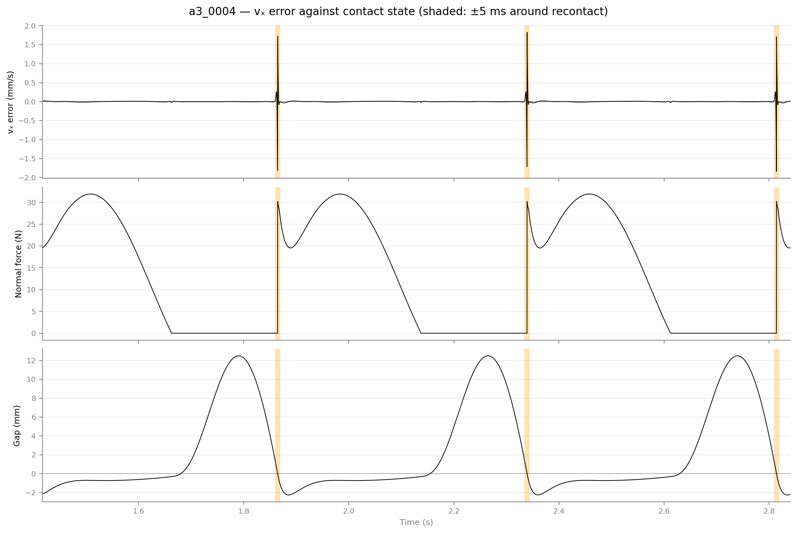
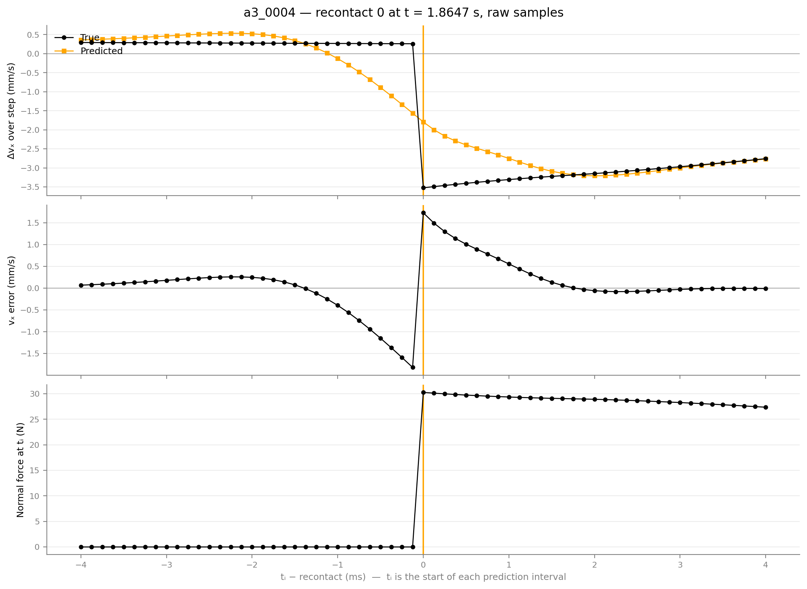
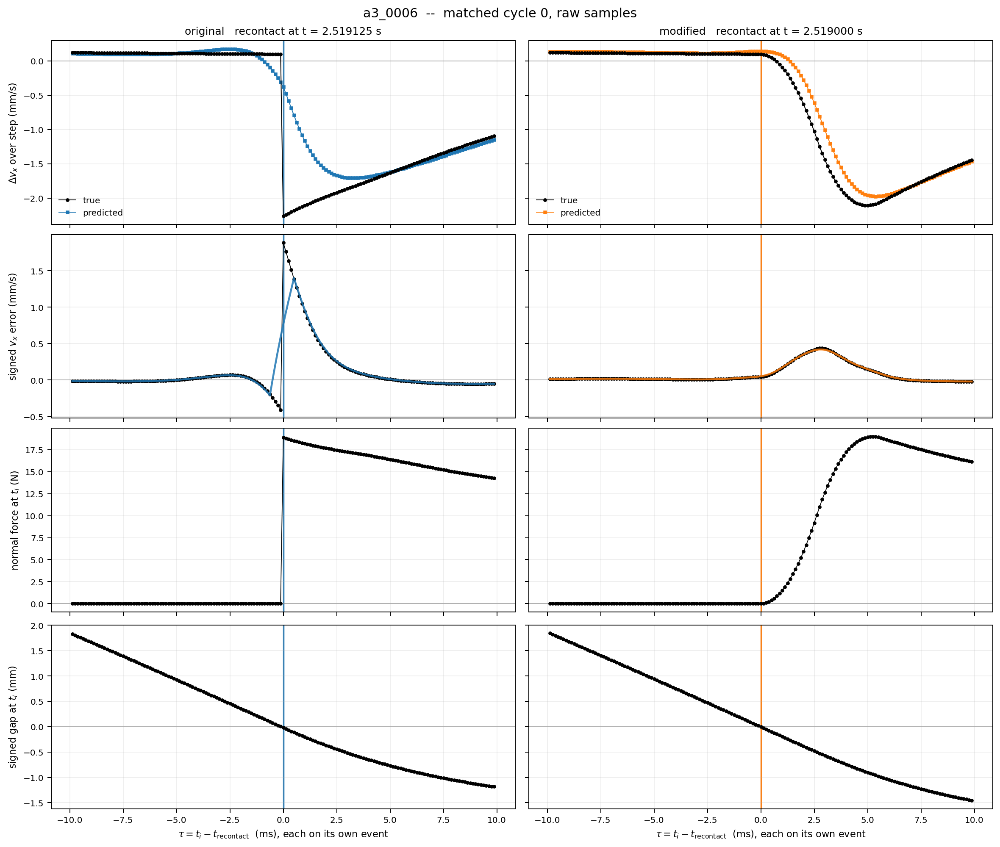

# Contact Mode Diagnostics
This project investigates how a mode-agnostic neural dynamics model predicts state changes across contact regimes.
We separate that into several questions:
1. **E1:** Does prediction error concentrate near contact transitions?
2. **E1A** How much does contact-onset regularization affect prediction error?

## Controlled simulation environment
We deliberately used a minimal system to make the mechanisms and labels inspectable:
- A 1kg sphere with two translational DOF
- $x$: normal to a fixed wall; $y$: tangential
- No rotation, gravity, table, or robot
- Friction coefficient $\mu = 0.5$
- Force motors acting along both coordinates
- MuJoCo 3.12.0, Newton solver, elliptic friction cone, solver tolerance $10^{-10}$
- Primary simulation and prediction interval: 0.125 ms

| Protocol | Purpose | Excitation |
|---|---|---|
| A2 | Quasi-stick→slide→quasi-stick under continuous normal contact | Constant normal preload; cyclic tangential force |
| A3 | Repeated controlled separation/recontact | Moving support connected through a spring–damper force |
| A2 quasi-stick control | Force variation without clear sliding | Tangential force kept below the intended sliding regime |
| A3 contact control | Normal dynamics without separation | Small support oscillations |
| A3 free control | Dynamics without wall contact | Support motion sufficiently far from the wall |

Dataset summary for both experiments:

| Item | E1 | E1A |
|---|---|---|
| Accepted dataset | 23 episodes | 60 pairs / 120 primary episodes |
| Train / validation / test | 13 / 5 / 5 episodes | 42 / 9 / 9 episodes per condition |
| Rejection outcome | 0 rejected | 0 rejected pairs |
| Split unit | Whole episode | Whole pair |

## E1 Experimental Design
A2 normal preloads over 8-12 N and varied the tangential force schedule. It aimed to produce repeated transitions while returning to stable quasi-stick.
A3 used a moving support to drive controlled separation and recontact. The support initially remains stationary for 0.3 s, then its oscillation amplitude increases smoothly over 0.5 s. After this startup ramp, its motion is

```math
t' = t - t_{\text{settle}}, \qquad t_{\text{settle}} = 0.3\ \mathrm{s}
```

```math
x_{\text{support}}(t) = x_0 + A\sin(2\pi f t' + \phi)
```

```math
v_{\text{support}}(t) = 2\pi f A\cos(2\pi f t' + \phi)
```

The applied forces were

```math
F_x = k\,(x_{\text{support}} - q_x) + c\,(v_{\text{support}} - v_x), \qquad F_y = 0
```

with $`k = 1000\ \mathrm{N/m}`$ and $`c = 30\ \mathrm{N\,s/m}`$.

These equations describe the full-amplitude motion; the implementation additionally includes the startup envelope and its derivative. Analysis excludes settling and the amplitude ramp, then one additional drive period, and begins at the next ascending zero-phase cycle boundary.

For transition episodes (A3), support amplitudes were 15-25 mm and frequencies 1.5-2.5 Hz. Initial tangential position, support phase, and nominal preload also varied. Episodes retained three analysis cycles.

Calibration was performed for labeling A2 so to reduce ambiguity on classification. The calibration procedures used:
- Fit preloads: 8, 10, 12 N
- Separate Validation preloads: 9, 11 N
- Six subthreshold force ratios per preload (total: 30)
- Five additional suprathreshold validation cases

The maximum creep speed measured in the calibration fit cases was approximately $4.898 \times 10^{-4}$ m/s. We used this value to establish the primary thresholds listed below. These thresholds were frozen after separate calibration and before production episode generation and model fitting.

| Quantity | Frozen value |
|---|---|
| Quasi-stick speed ceiling | $6.122 \times 10^{-4}$ m/s |
| Clear-slide speed floor | $2.449 \times 10^{-3}$ m/s |
| Friction-utilization boundary | $\rho = 0.98$ |
| Loaded-contact force threshold | $F_n > 0.1$ N |

Friction utilization is defined as

```math
\rho = \frac{\lVert F_t \rVert}{\mu F_n}
```

For geometrically active contact with $`F_n > 0.1\ \mathrm{N}`$, the operational A2 labels are:

- **QUASI_STICK:** $`|v_y| \leq 6.122 \times 10^{-4}\ \mathrm{m/s}`$ and $`\rho < 0.98`$
- **SLIDE:** $`|v_y| \geq 2.449 \times 10^{-3}\ \mathrm{m/s}`$ and $`\rho \geq 0.98`$
- **BOUNDARY:** remaining ambiguous cases

The boundary category preserves classification uncertainty. Sensitivity ranges were also frozen, but robustness of the prediction-error conclusions across those alternative thresholds remains to be evaluated.

## Learned Dynamics Baseline
Both experiments used the same mode-agnostic MLP architecture. E1A trained a separate model from scratch for each contact condition.

```math
(q_x, q_y, v_x, v_y, F_x, F_y) \to (\Delta q_x, \Delta q_y, \Delta v_x, \Delta v_y)
```

The model predicts the state increment over one simulation step. Evaluation uses the true current state as input; these results do not measure autonomous multistep rollout accuracy.

Architecture uses three hidden layers of width 128 with SiLU activations. No mode labels, contact forces, event times, or support phase were supplied as additional inputs.

Training used:
- Adam, lr $= 10^{-3}$
- Batch size: 1024
- Maximum 200 epochs
- Early stopping patience of 20 epochs
- Seed 42
- Training-set normalization, reused for validation; E1A computes these stats separately for the original and modified conditions
- Normalized MSE for optimization
- Episode-balanced validation MSE for checkpoint selection

All reported physical-unit errors are calculated after undoing target normalization. The error is
```math
e_i = \widehat{\Delta s}_i - \Delta s_i
```

Given the true current state, reconstructing the next state as $`\hat{s}_{i+1} = s_i + \widehat{\Delta s}_i`$ yields the same error:
```math
\hat{s}_{i+1} - s_{i+1} = \widehat{\Delta s}_i - \Delta s_i
```
Thus, the reported increment errors also represent one-step next-state prediction errors.

## E1 Result
Across 5 validation episodes, sample-weighted component RMSE was:

| Component | RMSE |
|---|---|
| $q_x$ | 0.3412 µm |
| $q_y$ | 0.003207 µm |
| $v_x$ | 0.03465 mm/s |
| $v_y$ | 0.0002714 mm/s |

<p align="center">
  
  
</p>

In A3 validation episode `a3_0004`, we observe $\pm 5$ ms recontact window contained 99.13% of the squared $v_x$ prediction error while covering only 2.10% of eligible samples. We also observe mode-dependent error structure for A2, however, slide $\to$ quasi-stick showed higher prediction error compared to quasi-stick $\to$ slide.
Therfore, E1 can be concluded that the prediction error can be strongly localized around recontact in this controlled simulator and model.

## E1A Experimental Design
We employ two conditions:

| Condition | Contact `solimp` |
|---|---|
| Original | `[0.9, 0.95, 0.001, 0.5, 2]` |
| Modified | `[0, 0.95, 0.001, 0.5, 2]` |

Mass, support stiffness/damping, contact `solref`, primary timestep, and learning architecture were held fixed. Moreover, each pair shared its initial conditions, support-drive parameters, and splits. Actual force histories could differ, because the spring-damper controller depends on each trajectory's evolving state.

E1A contains only A3 families:

| Family | Pairs |
|---|---|
| Separation/recontact | 20 |
| Sustained-contact control | 20 |
| Free-motion control | 20 |

## E1A Result
Recontact was identified geometrically, and each condition's error was aligned to its own time event:

```math
\tau = t_i - t_{\text{recontact}}
```

All error metrics are computed from unsmoothed, denormalized one-step prediction errors. The primary recontact window is $\pm 5$ ms, with sensitivity analyses at $\pm 2$, $\pm 10$, and $\pm 20$ ms. Each window is centered on the corresponding condition’s own geometric recontact event. The sensitivity analysis assesses whether the observed improvement depends strongly on the chosen window width.

Validation results were:

| A3 episode | Original ±5 ms RMSE | Modified ±5 ms RMSE | Reduction |
|---|---|---|---|
| a3_0006 | 0.5467 mm/s | 0.2090 mm/s | 61.8% |
| a3_0007 | 0.5796 mm/s | 0.2566 mm/s | 55.7% |
| a3_0017 | 0.6834 mm/s | 0.0932 mm/s | 86.4% |

<p align="center">
  
</p>

Regularizing contact onset substantially reduced recontact-window prediction error, and the improvement persisted across the evaluated window widths. However, accuracy changed unevenly across the cyclic trajectories: the modified model had lower error near recontact and during free flight, but higher error during shallow contact away from transitions.

An exploratory regional analysis localized this deterioration. Its cause remains unresolved: the intervention changes the shallow-contact dynamics and the simulated trajectories, while training coverage and optimization may also contribute.

To locate deterioration, we analyzed the error across three distinct regions. Each region was defined dynamically based on the specific condition's trajectory:

| Trajectory Region | Selection Rule |
| :--- | :--- |
| **Near recontact** | Within $\pm 5$ ms of a geometric recontact |
| **Shallow contact** | Gap $\le 0$, penetration 0–1 mm *(Must be >20 ms away from any separation or recontact)* |
| **Free flight** | Gap $> 0$ *(Must be >20 ms away from any separation or recontact)* |

### Performance Breakdown
The table below shows the episode-balanced $v_x$ RMSE evaluated over the three A3 validation episodes, calculated as:

```math
\mathrm{RMSE}_{R} = \sqrt{\tfrac{1}{3}\sum_{j} \mathrm{RMSE}_{j,R}^{2}}
```

| Region | Original (mm/s) | Modified (mm/s) | Change |
| :--- | ---: | ---: | :--- |
| Near recontact | 0.6061 | 0.1985 | **−67.2%** (Better) |
| Shallow contact | 0.01673 | 0.03321 | **+98.5%** (Worse) |
| Free flight | 0.006910 | 0.003749 | **−45.7%** (Better) |

Change $`= 100 \times (\mathrm{RMSE}_{\text{modified}} / \mathrm{RMSE}_{\text{original}} - 1)`$. Negative values indicate an improvement.